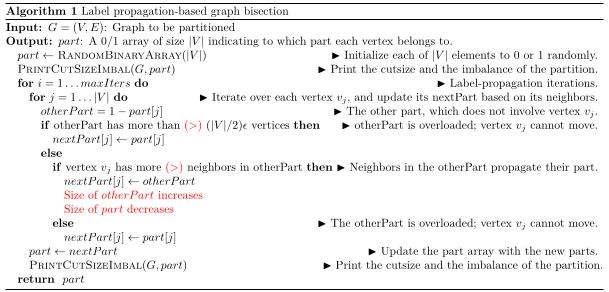

# Graph bisection in distributed fashion

How to separate the vertices of a graph in two parts in order to mini-
mize the cutsize ? We cannot find a exact solution in a reasonable com-
putation time. This report studies an algorithm that gives us a good
approximation, with three versions of it : sequential, parallel with full
communication and parallel with communication peers to peers

To create a random graph, we provide a script named create-graph.py that takes the number of vertices |V | in
the graph as the first argument, the number of edges in the graph as the second argument, and the name of the output
file for the graph as the third argument

It is a project of a class, not explicitly mentionned as a way of obfuscation. 